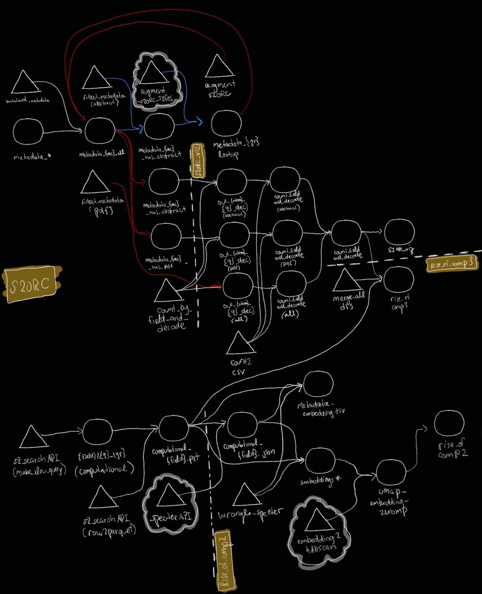

## Data

 - `20200705v1`: original dump from allenAI.
 - `metadata_by_decade_with_pdf_parses_and_cit/`: Each file contains metadata organized by decade for papers that have `has_pdf_parsed_body_text=true`
 - `metadata_by_decade_all/`: 
   - Each file contains metadata organized by decade that have all the information, e.g. same metadata than raw but organized by decade
   - Each file contains metadata organized by decade and in simplified form for papers who have at least an abstract.
   - Each file contains classification from `s2_fos`, based on abstract, venue and title.
   - Each file contains metadata organized by decade and in simpleified form for papers who have at least `has_pdf_parsed_body_text=true`.

#### The current dependency graphs...

